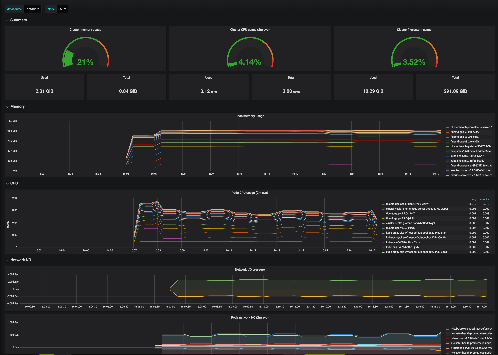

# Grafana Helm Chart

This repo contains helm charts to deploy Prometheus and Grafana to your
Kubernetes cluster. The Prometheus helm chart deploys the `node_exporter` and
`kube-state-metrics` to expose cluster metrics. The Grafana helm chart comes
with useful dashboards preconfigured.



## Install

```
cd ~/workspace/charts-grafana
helm install . --name cluster-health --namespace observability
```

## Prerequisites

### Configure Helm

The following commands may need to be executed for helm to function correctly.

```
kubectl create serviceaccount --namespace kube-system tiller
kubectl create clusterrolebinding tiller-cluster-rule
--clusterrole=cluster-admin --serviceaccount=kube-system:tiller
helm init --service-account tiller
```

## Port Forwarding

__Grafana__
1. Create the port forward to the Grafana dashboard
    ```bash
    kubectl port-forward deployment/cluster-health-grafana 3000:3000 --namespace observability
    ```
1. Retrieve the grafana dashboard password by running the following
    ```bash
    # Assuming you are on a Mac OSX
    kubectl get secret cluster-health-grafana --namespace observability --output json | jq -r '.data."admin-password"' | base64 --decode
    ```
1. Open your browser window and go to http://localhost:3000
1. Enter the username `admin` and the previously retreieved password.

__Prometheus__
1. Create the port forward to the Prometheus dashboard
    ```
    kubectl port-forward deployment/cluster-health-prometheus-server 9090:9090 --namespace observability
    ```
1. Open your browser window and go to http://localhost:9090

## Setting the default dashboard

1. Open the dashboard on the top left
1. Star the dashboard on the top right
1. Go to Configuration -> Preferences
1. Set the default dashboard

## Installation Caveats

### Cluster Size

Prometheus includes a few deployments, such as the prometheus server,
alertmanager, node exporter daemonset, and kube-state-metrics. Grafana
includes a deployment as well. You should consider this when deploying this
chart and sizing your cluster.

### Cluster with Admission Controllers

#### PodSecurityPolicy
The chart has `PodSecurityPolicy` enabled by default. See [here][pod-sec-policy] for more
information.

#### SecurityContextDeny
The grafana deployment uses [PodSecurityContext] to configure the grafana
container to [run with user id 472]. This means that the grafana deployment
will fail on any cluster with [`SecurityContextDeny`][security-context-deny]
enabled.


[PodSecurityContext]: https://kubernetes.io/docs/tasks/configure-pod-container/security-context/#set-the-security-context-for-a-pod
[run with user id 472]: http://docs.grafana.org/installation/docker/#migration-from-a-previous-version-of-the-docker-container-to-5-1-or-later
[security-context-deny]: https://kubernetes.io/docs/reference/access-authn-authz/admission-controllers/#securitycontextdeny
[pod-sec-policy]: https://kubernetes.io/docs/concepts/policy/pod-security-policy/
